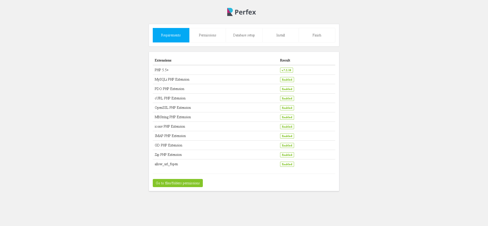
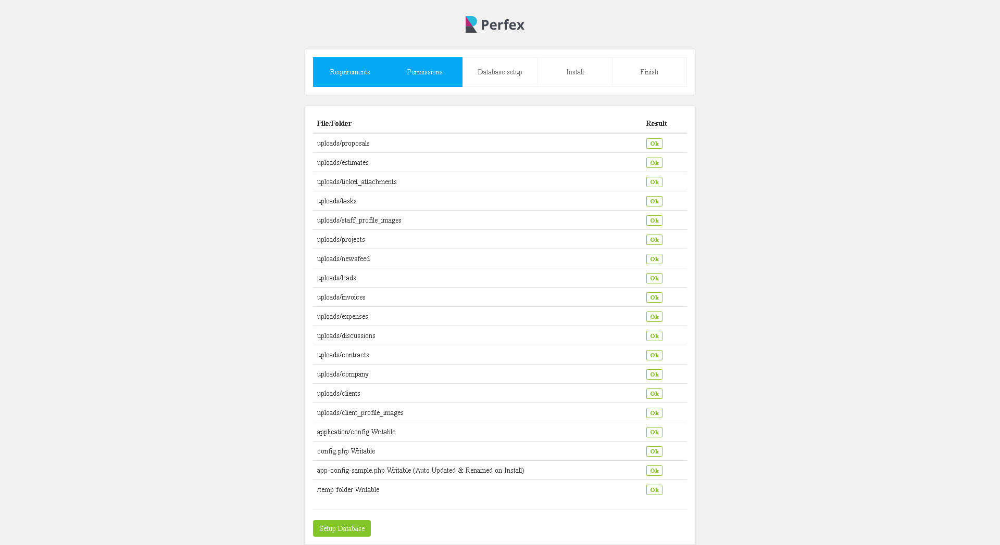
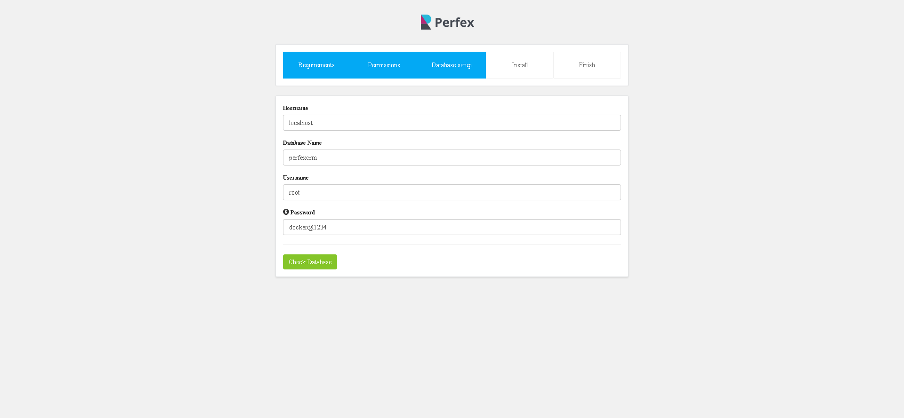
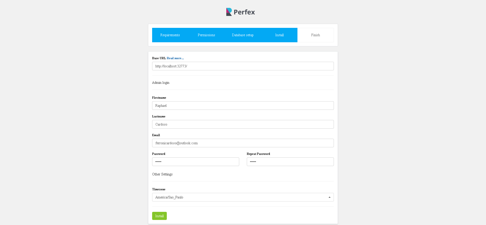
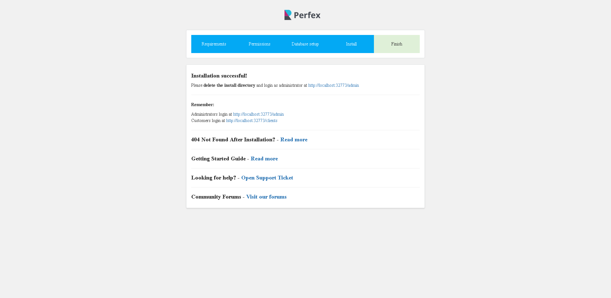
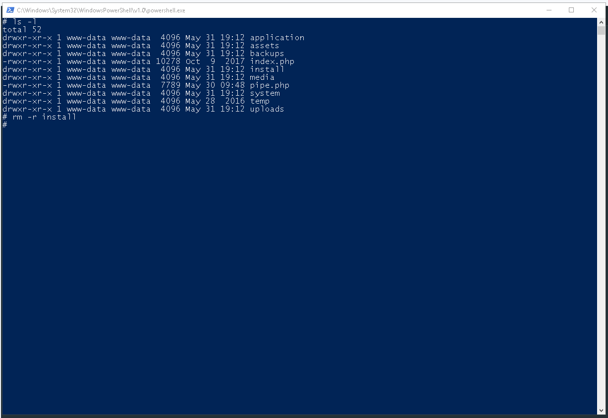
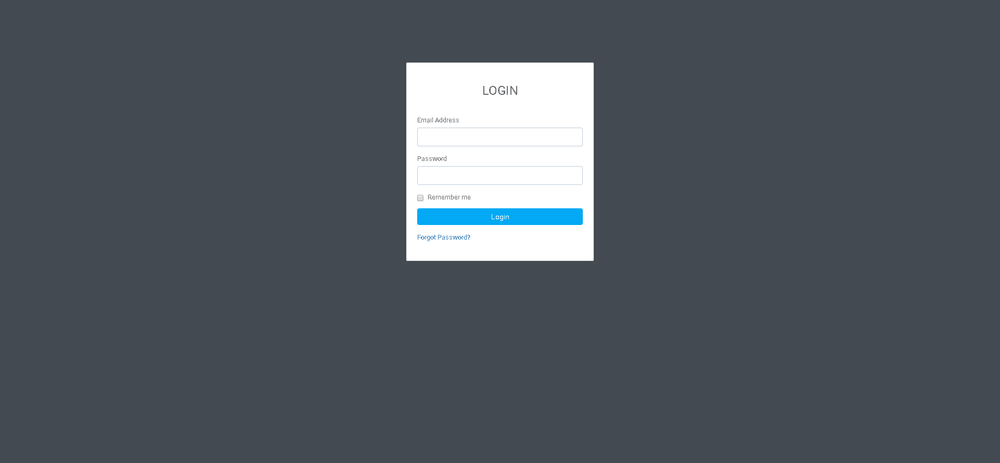

# Executando o Perfex CRM no Docker

Descompactar o fonte do Perfex CRM e substituir a pasta perfexcrm sobrescrevendo todo os arquivos.

Não é necessário editar o arquivo Dockerfile, porém ao analisar o arquivo temos:

- Na linha abaixo temos qual a imagem que utilizaremos para o nosso container.  
> `FROM php:7.2-apache`
- Na linha seguinte, informamos qual a port do container iremos expor
> `EXPOSE 80`

- Em seguida atualizamos os pacotes e instalamos os pacotes necessários

> `RUN apt-get update -y && \
    apt-get install -y libpng-dev libc-client-dev libkrb5-dev --no-install-recommends`

- Realizamos a configuração e ativação das extensões do php necessárias

> `RUN docker-php-ext-configure imap --with-kerberos --with-imap-ssl && \
    docker-php-ext-install -j$(nproc) imap`

> `RUN docker-php-ext-install mysqli gd zip`

- Ativamos o modulo de de reescrita de url essencial para o funcionamento da aplicação

> `RUN a2enmod rewrite`

- Copiamos os arquivos do Perfex CRM para o diretorio do apache

> `COPY perfexcrm/ /var/www/html/`

- Alteramos o próprietário do arquivo para o usuário do apache

> `RUN chown -R www-data:www-data /var/www/html/`

- Alteramos a permissão de leitura e escrita dos diretórios e arquivos conforme orientações do setup do Perfex CRM

> RUN chmod 755 /var/www/html/uploads/  
> RUN chmod 755 /var/www/html/application/config/  
> RUN chmod 755 /var/www/html/application/config/config.php  
> RUN chmod 755 /var/www/html/application/config/app-config-sample.php  
> RUN chmod 755 /var/www/html/temp/

## Compilando a imagem

Para realizar a criação da nossa imagem, basta acessar a url onde temos no nosso arquivo Dockerfile e executar o commando abaixo. Atentar-se ao ponto no final do commando, ele deverá ser incluso e indica o caminho onde encontrar os arquivos para a contrução da nossa imagem.

>docker build -t ferronicardoso/php-perfexcrm:latest .

Após a criação da imagem, poderemos executar o nosso container utilizando a imagem conforme exemplo abaixo onde informei um nome para a container e porta.

>docker run --name perfexcrm -itd -p 80:80 ferronicardoso/php-perfexcrm:latest

## Setup do Perfex CRM

Para a realização do setup, será necessário o banco de dados MySql. Podemos executar um container do MySql conforme comando abaixo:

> docker run --name=mysql -e 'MYSQL_ROOT_PASSWORD=docker@1234' -d mysql:5.7.23 

### Executando o setup

Lista dos modulos requeridos.

Permissões aplicadas.

Parametros para setup do banco de dados. É necessário que o Schema já tenha sido criado previamente.

Configurações adcionais como cadastro do usuário administrador e definição da URL Base.

Instalação concluida.

Para executar a aplicação, a pasta de instalação deverá ser excluida. Para isso necessário executar a linha de comando no docker para removar a pasta.

Ao executar a URL teremos o Perfex CRM funcionando.

